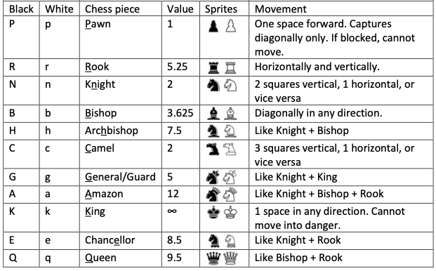

# XXL Chess Game

## Table of Contents
  - [Technology](#technology)
  - [Execution](#execution)
  - [Features](#features)

## Technology
- Java as programming language.
- Processing library for graphics.
- Gradle for dependency manager.

## Execution
- Download and install Gradle at this [website](https://gradle.org/install/)
- Create an empty folder, then open it with a code editor.
- Clone the project with git.
- Change current directory to the parent folder that contains the folder `src`.
- Update `config.json` to configure the game if you like.
- Run: ```gradle run```.

## Features
- Player can configure the game such as starting board, player's piece colour, piece movement speed, etc. by `config.json`.
- Two game modes: Player vs Player and Player vs Computer.
- Here are chess pieces, their movements and values:

- The player wins the game if:
  - They checkmate the opponent's king.
  - The opponent ran out of time.
